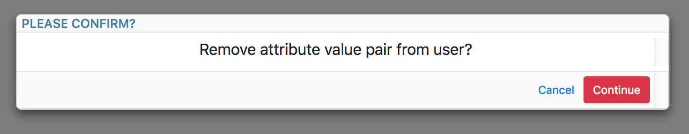
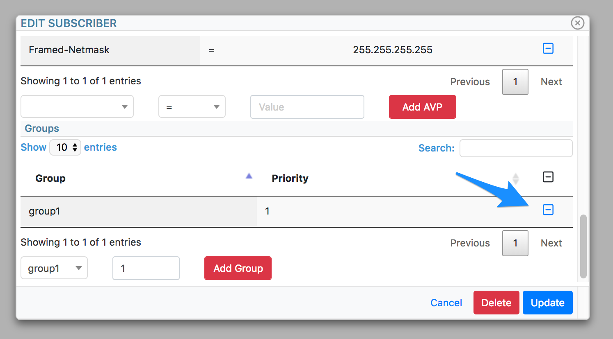
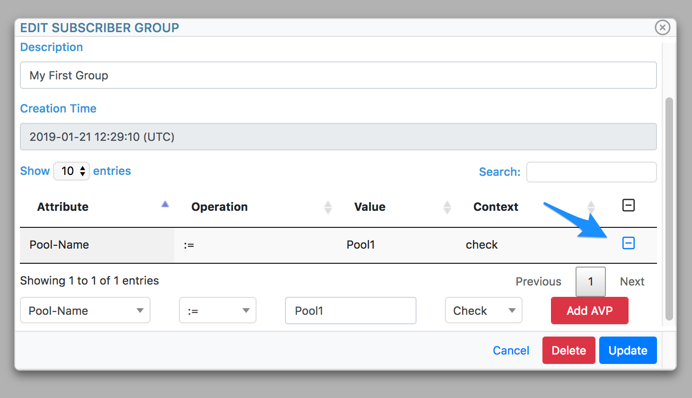
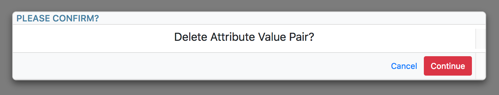

.. _userguide:

==================
TRADIUS User guide
==================

Introduction
============
The Tachyonic Project provides a web GUI for freeradius: a module called *tradius*. Also provided are the freeradius
configuration files to reference the tachyonic database for AAA purposes. Here we describe how one can make use of the
*tradius* Tachyonic module to interact with Freeradius.

The user guide for Tachyonic Project's web GUI, aka Photonic, can be found
`here <http://tachyonic.org/sphinx/photonic/latest/index1.html>`_.

Components
==========
When the *tradius* module is active on in Photonic, two new Menu items appear:

Infrastructure
--------------
Settings related to the RADIUS server is found underneath the *Infrastructure* Menu entry, in the section called
*Radius*:


Services
--------
Settings related to subscriber accounts can be found in underneath the *Services* Menu entry, in the section called
*Subscribers*:


.. note::

    Remember to select the appropriate region in the context menu on the left hand side, so that the appropriate
    *tradius* endpoint will be in effect. Failure to do this will result in a "Endpoint not found" error message
    popping up whenever any of these entries are accessed.

Virtual Servers
===============
Tradius has a concept of virtual servers. This is the first step in setting up your environment, and is also the
method of adding a RADIUS server. Even though one only needs one physical freeradius server, tradius provides
the capability to make this appear as multiple (virtual) RADIUS servers. This could be usefull in multi-tenant
environments, such as Service Providers offering RADIUS-as-a-service, or logically splitting up network devices into
separate groups (e.g. mobile vs fixed), and having them authenticate against "different" RADIUS servers.

.. _viewradius:

Viewing RADIUS servers
----------------------

To view a list of currently configured virtual RADIUS servers, navigate to ``Infrastructure -> Radius -> Virtual``. On
newly installed systems this list will of course be empty.

Once RADIUS servers have been added, one may view the details of a specific entry by clicking on the icon next to it:


Adding a RADIUS server
----------------------
Navigate to ``Infrastructure -> Radius -> Virtual`` and click on ``Add Virtual``.
Type in a name and click on ``Add Virtual``


Associating NAS to RADIUS server
--------------------------------
After the server has been created, click on the ``Edit`` button. At the bottom one may provide the information for each
Network Access Server (NAS). Complete with the relevant information, and click the ``Add NAS`` button:


Disassociating a NAS from RADIUS server
---------------------------------------
From the :ref:`editradius` window, click on the removal icon next to the NAS to be removed:


and then on the ``Continue`` button in the confirmation window:


.. _editradius:

Updating a RADIUS server
------------------------
Follow the instruction to :ref:`view <viewradius>` the virtual RADIUS server to be modified, and click the ``Edit`` button
to make the changes. Update the required information, and click the ``Update`` button:


Removing a RADIUS server
------------------------
To remove a Virtual RADIUS server, follow the same procedure as in :ref:`editradius`, click the ``Delete`` button, and
then the ``Continue`` button in the confirmation dialog:


Subscribers
===========

.. _viewsub:

Viewing Subscribers
-------------------
To view a list of currently configured subscribers, navigate to ``Services -> Subscribers``. On
newly installed systems this list will of course be empty.

Once subscribers have been added, one may view the details of a specific entry by clicking on the icon next to it:


Adding a subscriber
-------------------
To add a subscriber, navigate to ``Services -> Subscribers``, and click on the ``Add Subscriber`` button.

From the "Virtual Id" drop down box, select the appropriate Virtual RADIUS server, and complete the remainder of
the information:


Finally, click on the ``Add subscriber`` button to complete the creation of a new subscriber.

Adding AV-Pairs to a subscriber
-------------------------------
Navigate to :ref:`editsub` and scroll down to the "Attribute Value Pairs" table. Complete the information in the
form below it, and click on ``Add AVP`` button.


Removing AV-Pairs from a subscriber
-----------------------------------
Navigate to :ref:`editsub` and scroll down to the "Attribute Value Pairs" table. Click on the "remove" icon
next to the AVP to be removed:


and finally on the ``Continue`` button in the confirmation dialog:



.. _editsub:

Updating a subscriber
---------------------
Follow the instructions to :ref:`viewsub`, and click on the ``Edit`` button to make the changes.
Update the required information, and click on the ``Update`` button to save the changes:


.. _assgroup:

Associating a subscriber to a group
```````````````````````````````````
Navigate to :ref:`editsub` and scroll down to the "Groups" table. Select the group to be applied, and an optional
priority. Finally, click on the ``Add Group`` button:

.. image:: _static/img/assign_group.png

Groups with higher values for priority are preferred over groups with lower values.

Disassociating a subscriber from a group
````````````````````````````````````````
Navigate to :ref:`editsub` and scroll down to the "Groups" table. Click on the "remove" icon next to the group to be
disassociated:



and finally on the ``Continue`` button in the confirmation dialog:


Deleting a subscriber
---------------------
To remove a subscriber, follow the same procedure as in :ref:`editsub`, click the ``Delete`` button, and
then the ``Continue`` button in the confirmation dialog:

.. image:: _static/img/confirm_subscriber.png

This action will also result in a Packet of Disconnect (POD) be sent if the user is currently logged in.


Groups
======
Sometimes multiple subscribers require one or more of the the exact same AVP to be returned.
Instead of assigning such AVP's to multiple
subscribers, tradius offers the ability to assign groups to subscribers. This allows one to associate AVP's to groups,
and when Freeradius responds, all the attributes belonging to the each of the groups will be added to responses for
subscribers that have those groups associated.

.. _viewgroup:

Viewing groups
--------------
To view a list of currently configured RADIUS AVP groups, navigate to ``Infrastructure -> Radius -> Groups``. On
newly installed systems this list will of course be empty.

Once Groups have been added, one may view the details of a specific entry by clicking on the icon next to it:


Adding a group
--------------
Navigate to ``Infrastructure -> Radius -> Groups`` and click on ``Add Group``.
Type in a name and click on ``Add Group``


.. _addavptogroup:

Adding AV-Pairs to a group
--------------------------
Navigate to :ref:`editgroup` and scroll down to the AVP table. Complete the information in the
form below it, and click on ``Add AVP`` button.


Removing AV-Pairs from a group
------------------------------
Navigate to :ref:`editgroup` and scroll down to the AVPG table. Click on the "remove" icon
next to the AVP to be removed:



and finally on the ``Continue`` button in the confirmation dialog:



.. _editgroup:

Updating a group
----------------
Follow the instruction to :ref:`view <viewgroup>` the virtual group to be modified, and click the ``Edit`` button
to make the changes. Update the required information, and click the ``Update`` button:


Deleting a group
----------------
To remove a AVP Group, follow the same procedure as in :ref:`editgroup`, click the ``Delete`` button, and
then the ``Continue`` button in the confirmation dialog:


RADIUS accounting
=================
In order to view the accounting records, as written to the database by Freeradius, navigate to
``Infrastructure -> Radius -> Accounting``. Here one my view information such as:

* Username
* NAS
* Login time
* Logout time
* IP address
* Bytes Input
* Bytes Output

Viewing and clearing subscriber sessions
========================================
In order to view the information of currently logged-in subscribers, as well as to disconnect them by means of POD,
navigate to ``Infrastructure -> Radius -> Sessions``.

Here one my view information such as:

* Username
* NAS
* Login time
* IP address

To disconnect a user, click the disconnect icon to the right of the user. Use the search bar above the table to find
the relevant user. As with all Tachyonic tables, the search bar searches through the fields of all these columns

.. note::

    In order for the POD to occur, the ``tradius radius manager`` needs to be running.

IP Pools
========
In some cases it is required to send Framed-IP-Address IP's that has been allocated from a pool,
instead of e.g. allocating from a pool pre-configured on a NAS by returning a pool attribute, or manually having to
add Framed-IP-Adresses one by one to subscribers.

Tradius provides ip pools for this purpose. One may create pools, and inform Freeradius to allocate values for
Framed-IP-Address from these Pools.

Each IP address, along with its associated session data (if any), is stored as an entry in a table in the database.
Pool ranges can of course be arbitrarily large. For optimal performance during authentication
time, the creation of these entries happen once off (at pool creation time) in the background.

.. _viewpool:

Viewing Pools
-------------
To view a list of currently configured IP Pools, navigate to ``Infrastructure -> Radius -> IP Pool``. On
newly installed systems this list will of course be empty.

Once IP Pools have been added, one may view the details of a specific entry by clicking on the icon next to it:


.. _addpool:

Creating a pool
---------------
Navigate to ``Infrastructure -> Radius -> IP Pool`` and click on ``Add Pool``.

Type in a name and click on ``Add Pool``


.. note::

    In order to create and remove ranges from Pools in the database, the ``tradius radius manager`` needs to be running.

.. _addips:

Adding IPs to a pool
--------------------
Adding IP addresses to a pool is done by means of prefixes. Multiple prefixes can be added to a single Pool.

For example, to add the range of addresses from 192.0.2.1 to 192.0.2.255 to a pool, navigate to :ref:`edit <editpool>`
the pool, complete the form at the bottom with the required prefix (192.0.2.0/24 in this case), make sure
the "Add/Append Prefix" is selected, and click on the ``Request`` button:


Removing IPs from a pool
------------------------
Follow the same procedure as in :ref:`addips` to add the range to be removed,
but this time select "Remove Pool/Prefix" from the drop-down menu before clicking the ``Request`` button:


.. _editpool:

Updating a Pool
---------------
Follow the instruction to :ref:`view <viewpool>` the IP Pool to be modified, and click the ``Edit`` button
to make the changes. Update the required information, and click the ``Update`` button:


Deleting a pool
---------------

To remove an IP Pool, follow the same procedure as in :ref:`editpool`, click the ``Delete`` button, and
then the ``Continue`` button in the confirmation dialog:


This will also delete all entries in the database associated with this pool.

.. note::

    In order for the Pools to be created/deleted in the database, the ``tradius radius manager`` needs to be running.

Using a pool
------------
In order to let Freeradius allocate the Framed-IP-Address attribute from one of the configured IP pools, it needs to
be informed to do so via the *check* internal (:=) "Pool-Name" attribute. Check Attributes
are only supported for groups, one thus need to make use of the group feature for this functionality.

After the pool has been :ref:`created <addpool>`, and prefixes have been :ref:`allocated <addips>`,
navigate to :ref:`addavptogroup`, select "check" type, internal operation ":=",
and "Pool-Name" attribute. Enter the name of the applicable pool, and Click the ``Add AVP`` button:


Users that have this group :ref:`associated <assgroup>`, will be allocated Framed-IP-Addresses from this pool.
